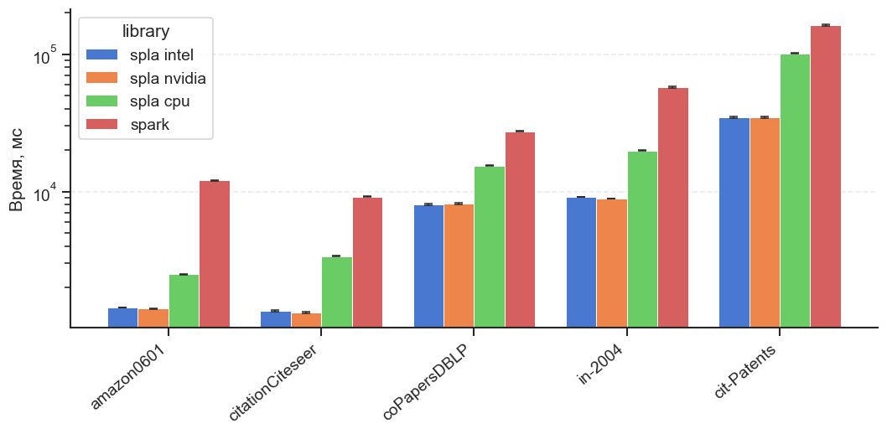
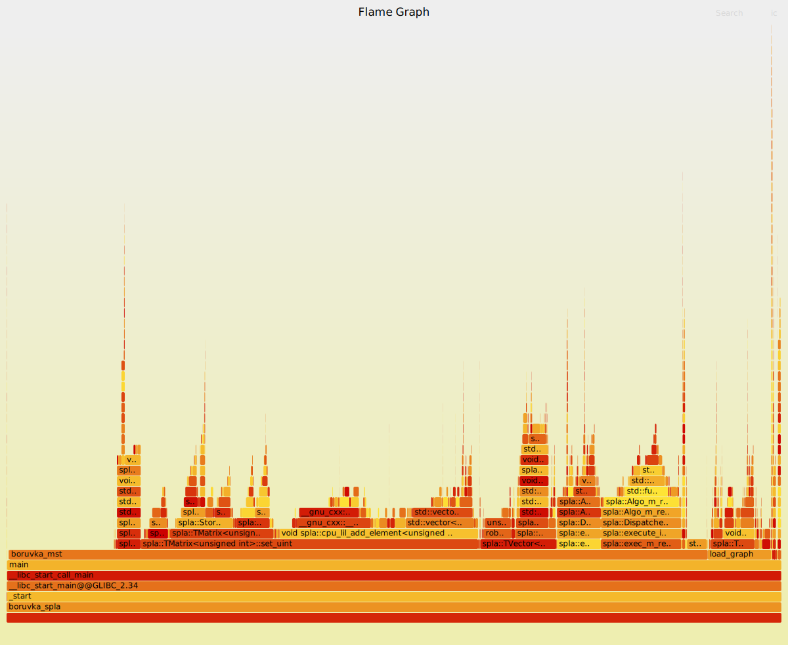
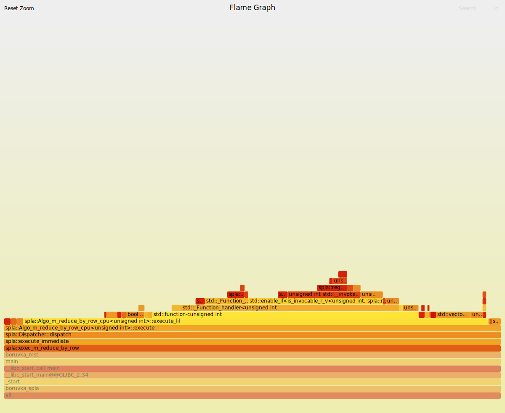
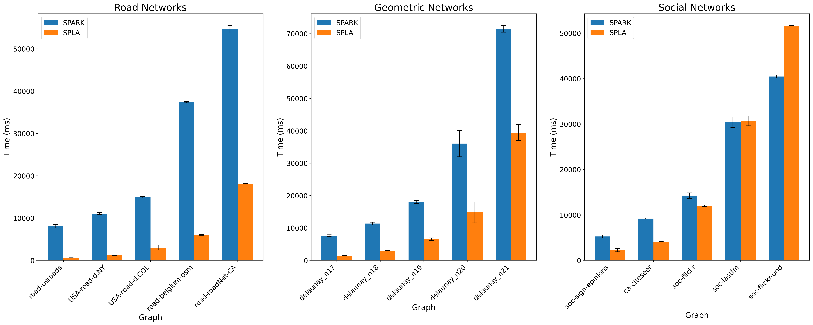
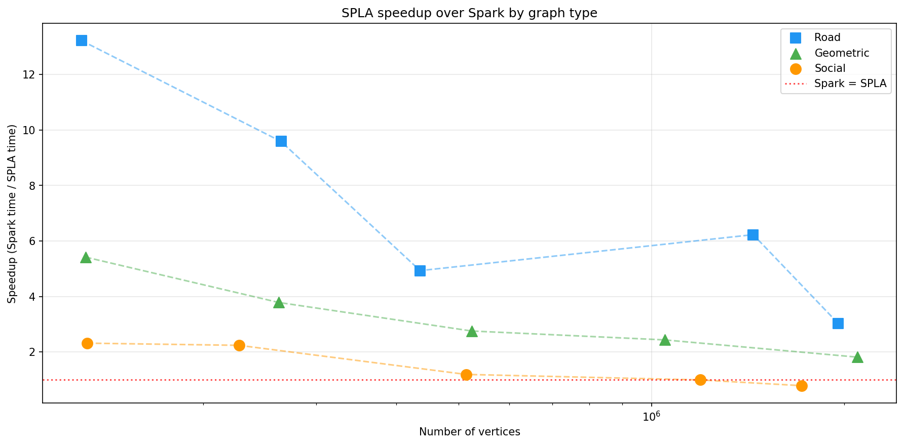
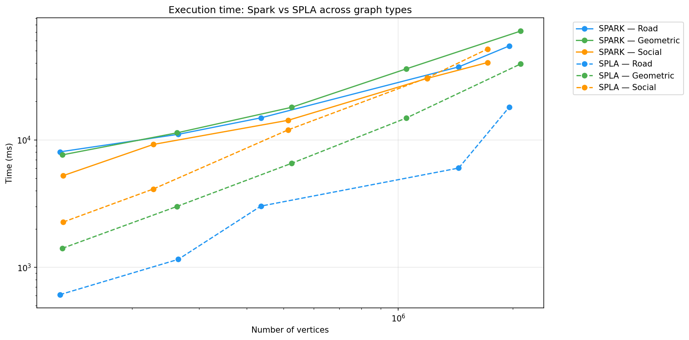
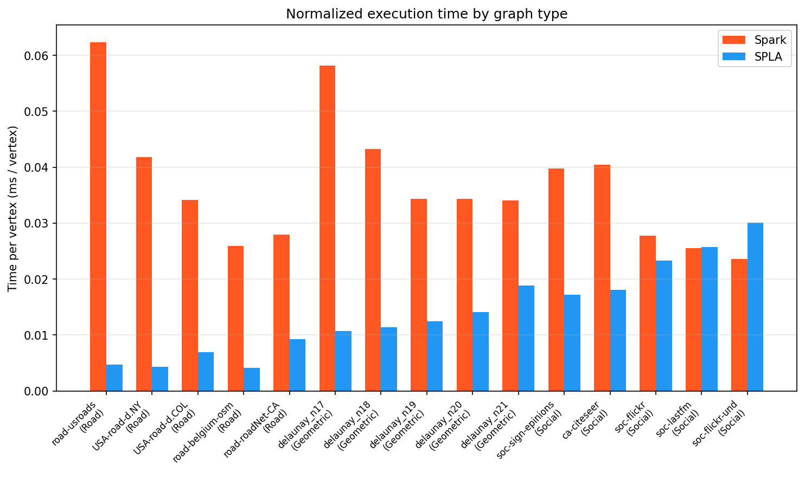

# Борувка на SPLA и Apache Spark. Результаты

Шальнев Владислав, Кадочников Даниил

---

# Характеристики машины Эксперимент 1

**ОС:** Ubuntu 24.04 LTS

**CPU:** 10th Gen Intel Core i5-10300H @ 2.50 GHz
- Hyper-Threading включен
- L1: 256 КБ, L2: 1 МБ, L3: 8 МБ

**GPU:** NVIDIA GeForce GTX 1650 Ti Mobile
- 4 ГБ VRAM GDDR6
- драйвер 580.126.09
- CUDA Toolkit 13.0.97

**RAM:** 16 ГБ DDR4, 3200 МГц

---

# Программное обеспечение

- gcc 13.3.0
- OpenJDK 11.0.30
- SPLA (commit b81d1e2)
- Apache Spark 3.5.1
- OpenCL 3.0
- Intel OpenCL Runtime 26.05.37020.3
- CMake 3.28.3

---

# Данные Эксперимент 1

| Граф | Количество вершин | Количество рёбер |
|:------|:------|:-------|
| amazon0601 | 403 394 | 2 443 408 |
| citationCiteseer | 268 495 | 1 156 647 |
| coPapersDBLP | 540 486 | 15 245 729 |
| in-2004 | 1 382 908 | 13 591 473 |
| cit-Patents | 3 774 768 | 16 518 947 |

Источники: [A High-Performance MST Implementation for GPUs 2023](https://userweb.cs.txstate.edu/~ag1548/_static/sc23.pdf), [SuiteSparse Matrix Collection](https://sparse.tamu.edu/)

---

# Эксперимент 1

**Цель:** сравнить время работы алгоритма Борувки на SPLA (CPU, NVIDIA OpenCL и Intel OpenCL) и Apache Spark на реальных графах разного размера

---

# Ход экспериментов

- 20 запусков алгоритма на каждом графе и библиотеке
- Вычисление среднего времени и доверительных интервалов
- Визуализация и анализ результатов

---

# Эксперимент 1

---

# Результаты

- SPLA CPU, Intel OpenCL и NVIDIA OpenCL показывают сопоставимое время — OpenCL не даёт заметного ускорения
- На малых графах SPLA быстрее Spark в 2-5 раз
- На больших графах разрыв сокращается

---

# Профилирование SPLA

---

# Профилирование SPLA

---

# Анализ результатов

- Использование OpenCL accelerator не дает ускорения, реализация `exec_m_reduce_by_row` на OpenCL отсутствует
- В SPLA отсутствует поддержка пользовательских типов
- Операции над матрицами на CPU, нет select, мало операций с масками

---

# Характеристики машины Эксперимент 2

**ОС:** Windows 10 Pro (22H2)

**CPU:** 12th Gen Intel Core i5-1235U @ 1.30 GHz
- Ядра: 10 (2 производительных + 8 эффективных)
- Потоки: 12
- L3 Кэш: 12 МБ

**RAM:** 32 ГБ DDR4, 3200 МГц

---

# Данные Эксперимент 2

# Данные эксперимента: Road Networks

| Граф | Вершины | Рёбра |
|:------|--------:|--------:|
| road-usroads | 129 164 | 165 435 |
| USA-road-d.NY | 264 346 | 730 100 |
| USA-road-d.COL | 435 666 | 1 042 400 |
| road-belgium-osm | 1 038 823 | 1 549 970 |
| road-roadNet-CA | 1 957 027 | 2 760 388 |

---

# Данные эксперимента: Geometric Graphs

| Граф | Вершины | Рёбра |
|:------|--------:|--------:|
| delaunay_n17 | 131 072 | 393 176 |
| delaunay_n18 | 262 144 | 786 396 |
| delaunay_n19 | 524 288 | 1 572 823 |
| delaunay_n20 | 1 048 576 | 3 145 686 |
| delaunay_n21 | 2 097 152 | 6 291 408 |

---

# Данные эксперимента: Social & Collaboration Networks

| Граф | Вершины | Рёбра |
|:------|--------:|--------:|
| soc-sign-epinions | 131 828 | 840 799 |
| ca-citeseer | 227 320 | 814 134 |
| soc-flickr | 513 969 | 3 190 452 |
| soc-lastfm | 1 191 805 | 4 519 330 |
| soc-flickr-und | 2 394 385 | 15 555 042 |

Источник: [Network Repository (NRVIS)](https://networkrepository.com/)

---

# Эксперимент 2

**Цель:** исследовать влияние типа графа на относительную 
производительность реализаций алгоритма Борувки на SPLA (CPU) и Apache Spark

**Вопрос:** зависит ли соотношение времени работы SPLA и Spark 
от структурных свойств графа?

**Типы графов:**
- **Road** — разреженные дорожные сети, много итераций Борувки
- **Geometric** — триангуляции Делоне, средняя плотность
- **Social** — социальные/коллаборационные сети, высокая плотность, мало итераций

---

# Ход эксперимента 2

### Влияние типа графа
- 5 запусков алгоритма на каждом графе и библиотеке, 3 прогрева
- Сравнение SPLA (CPU) и Spark
- Визуализация и анализ результатов

---

# Эксперимент 2 — Сравнение по типу графа

---

# Эксперимент 2 — Ускорение SPLA относительно Spark

---

# Эксперимент 2 — Время по размеру и типу графа

---

# Эксперимент 2 — Нормализованное время (ms/вершину)

---

# Выводы Эксперимент 2

1. **Тип графа влияет на соотношение производительности** SPLA и Spark
2. **Road-графы** — наибольший разрыв: Spark тратит больше на многочисленные итерации
3. **Social-графы** — наименьший разрыв: мало итераций, overhead Spark менее заметен
4. **Главный фактор** — число итераций алгоритма Борувки, которое определяется структурой графа
5. При выборе реализации MST следует учитывать **тип входных данных**

